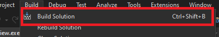

<h1 align="center">
  XP Entrevista Técnica - Fevereiro 2024
</h1>


<p align="center">
  <a href="#sobre">Sobre</a> •
  <a href="#como-executar">Como executar</a> •
  <a href="#funcionalidades">Funcionalidades</a> •
  <a href="#dúvidas">Dúvidas</a>
</p>

# Sobre
* Requisitos: 
    * Criar um serviço que permita o time de operação realizar manutenção nos produtos de investimentos.
        - Funcionalidades:
            - Gestão dos produtos financeiros
            -  Disparo de e-mail diário para notificar os administradores a respeito dos produtos com vencimento próximo
    * Criar um serviço que permita o cliente comprar, vender e consultar seus investimentos.
        - Funcionalidades:
            - Negociar produto financeiro (Compra e Venda)
            - Extrato do produto
* Solução:
    - Serviço de gerenciamento de cliente
    - Serviço de gerenciamento de produtos
    - Serviço de gerenciamento de portfólio
    - Serviço de disparo de email
* Para propósito de testes, o banco de dados já conta com algumas informações que podem ser consultadas e alteradas pelos métodos explicados posteriormente.

# Como executar

* Pré-requisitos:
    - Visual Studio 2022, versão 17.9.1+
    - .NET 8.0

* Etapas
    - 1 - Clonar ou baixar o repositório.
    ```bash
    $ git clone https://github.com/jp-kang/XPTechnicalInterview
    ```
    - 2 - Pelo Visual Studio, selecionar a opção de abrir projeto ou pasta, e escolher o arquivo XPTechnicalInterview.sln.
    - 3 - Na aba "Build" selecionar a opção "Build Solution", conforme indicado abaixo.

        
    - 4 - Alterar modo de execução para "Release" e iniciar a aplicação, conforme indicado pela imagem abaixo. Ao executar, uma janela de navegador irá abrir automaticamente na página do Swagger.
    
        
    - 5 - Utilizar endpoints disponibilizados no Swagger


# Funcionalidades

## Clientes

 - Metódos para criação, edição, deleção, listagem e leitura de clientes.
 - Obs.: O método de deleção realiza uma deleção lógica, e não física.

## Email

 - Serviço utilizado para disparar envio de emails.
 - O campo "recipients" define os destinatários do email, é possível colocar mais de um destinatário para o email separando os endereços de email com ';' (ponto-vírgula).
 - O campo "daysToExpire" indica a quantidade de dias entre o momento da execução e o limite máximo da expiração dos produtos. 
    - Exemplo: Para receber os produtos que expiram nos próximos 30 dias
        ```json
        "daysToExpire": 30
        ````
 - *Obs*.: Apesar do requisito de "disparo de e-mail diário", foi optado pela não implementação dessa funcionalidade. Na "vida real", optaria pela implementação de um agente externo, como uma AzureFunctions com TimerTrigger para realizar a chamada do endpoint e disparar o e-mail diariamente

## Produtos Financeiros

 - Metódos para criação, edição, deleção, listagem e leitura de produtos financeiros.
 - O métodos GET /FinancialProduct/days/{days} recebe um inteiro X, e retorna uma lista em que a data de expiração está entre a data atual e os próximos X dias.
 - Obs.: O método de deleção realiza uma deleção lógica, e não física.

## Investimentos
 
 - O método POST /Investment/buyInvestment realiza a compra de um investimento, recebendo o id de um cliente, o id de um produto e a data/hora da compra.
 ```json
  "clientId": 0,
  "productId": 0,
  "purchaseDate": "2024-02-27T12:00:00.000Z"
```
 - O método POST /Investment/sellInvestment realiza a venda de um investimento recebendo o id do investimento e a data/hora da venda.
 ```json
  "investmentId": 0,
  "sellDate": "2024-02-27T12:00:00.000Z"
  ```
 - O método GET /Investment/{id} recebe o id de um investimento e retorna os dados do mesmo.
 - O método GET /Investment/getInvestmentsByClientId recebe o id de um cliente, e retorna uma lista com todos os investimentos desse cliente.
 - O método GET /Investment/getActiveInvestmentsByClientId recebe o id de um cliente, e retorna uma lista com todos os investimentos ativos desse cliente.
 - O método GET /Investment/getSoldInvestmentsByClientId recebe o id de um cliente, e retorna uma lista com todos os investimentos vendidos desse cliente.
 - O método GET /Investment/getInvestmentsByProductId recebe o id de um produto, e retorna uma lista com todos os investimentos desse produto.

## Modelos


* Acima, pode-se ver os modelos dos dados. Há uma relação de 1:n entre FinancialProduct e Investment, assim como de Client para Investment. Em poucas palavras, isso significa que um investimento só existe a partir de um produto financeiro e um cliente, que um cliente pode ter múltiplos investimentos, e que podem ter vários investimentos de um mesmo produto.
* Todos os modelos e informações relativo aos endpoints está documento no Swagger da aplicação

 # Dúvidas
 Para dúvidas a respeito do código, execução ou funcionamento, favor entrar em contato pelo e-mail: jpkang10@gmail.com